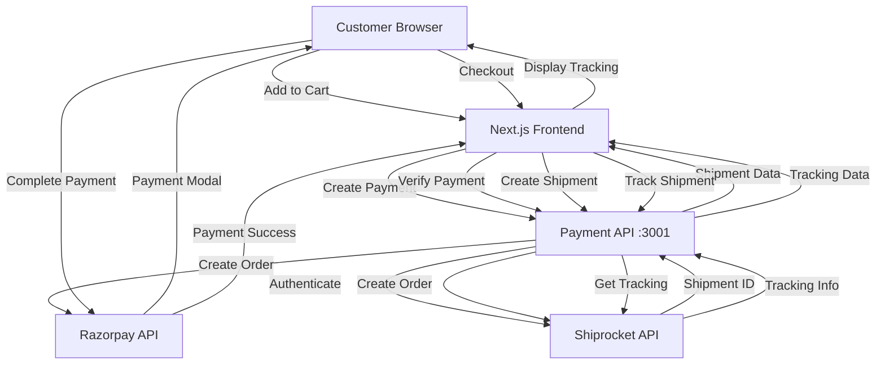
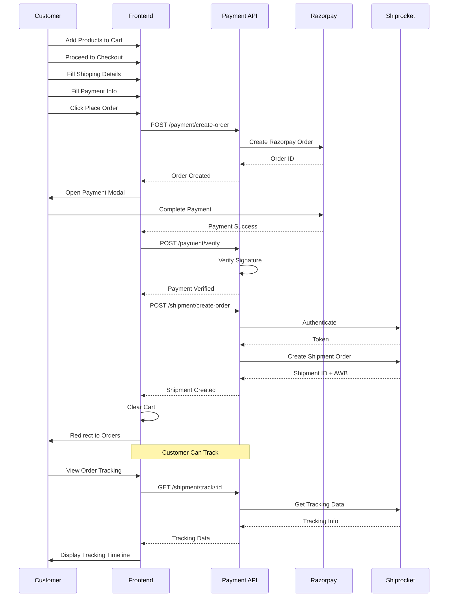
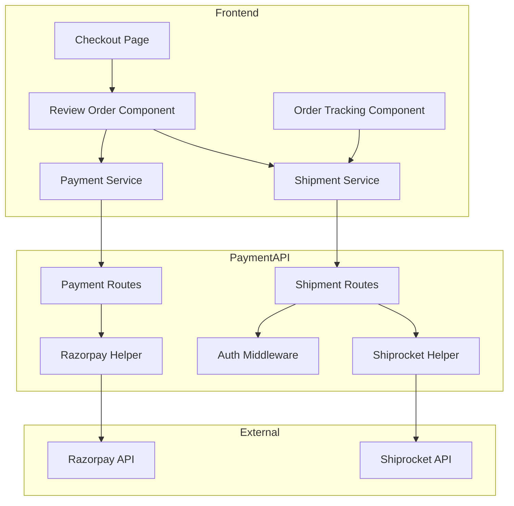
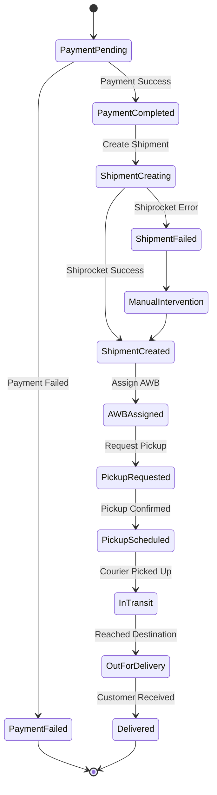
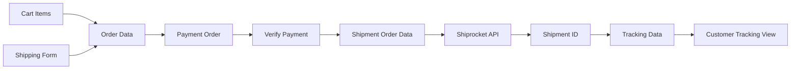
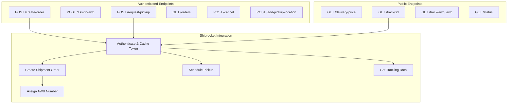
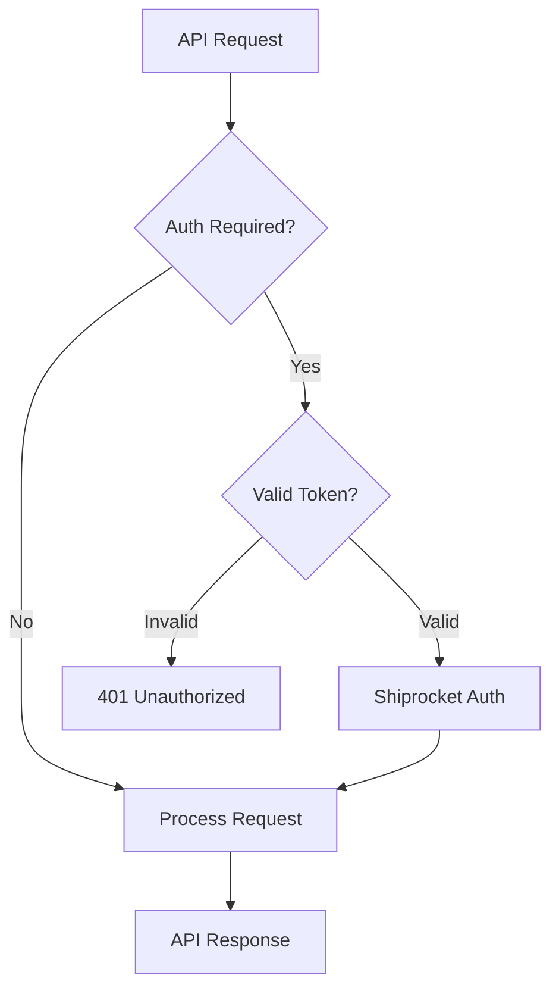
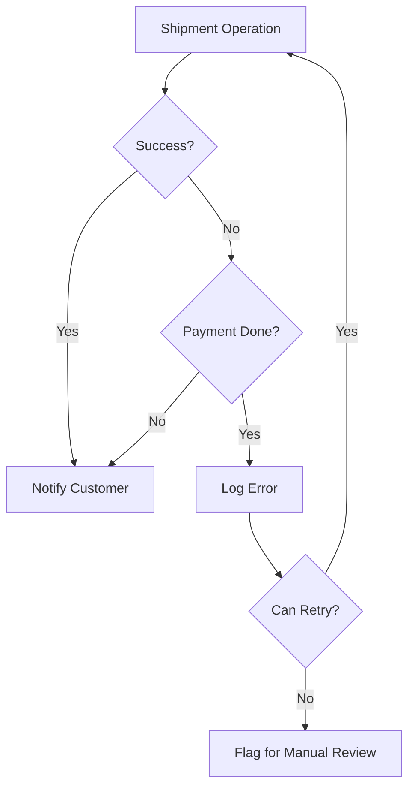
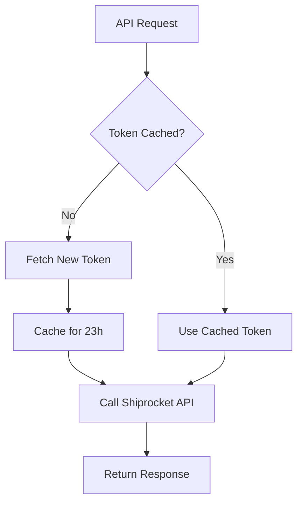
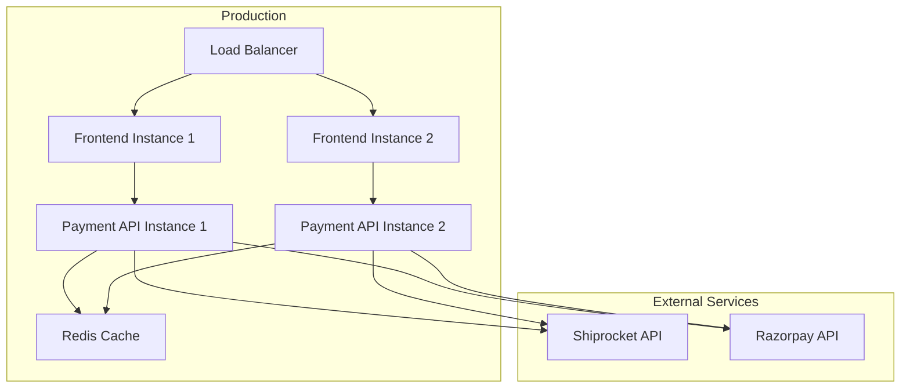

# Shipment System Architecture

## System Overview Diagram

## Complete Order Flow

## Component Architecture

## Shipment Lifecycle

## Data Flow

## API Endpoint Structure

## Security Flow

## Error Handling Flow

## Performance Optimization

---

## Key Design Decisions

### 1. **Separate Payment API Service**
- Runs on port 3001
- Independent from main backend
- Dedicated to payment and shipment operations
- Easier to scale and maintain

### 2. **Token Caching**
- 23-hour cache duration
- Prevents rate limiting
- Reduces authentication overhead
- Automatic refresh on expiry

### 3. **Async Shipment Creation**
- Non-blocking operation
- Payment completes first
- Shipment created in background
- Graceful error handling

### 4. **Public Tracking Endpoints**
- No auth required for tracking
- Requires shipment ID or AWB
- Better customer experience
- Reduces support load

### 5. **TypeScript Integration**
- Full type safety on frontend
- Auto-completion in IDEs
- Compile-time error checking
- Better developer experience

---

## Deployment Architecture

---

**Architecture Version:** 1.0  
**Last Updated:** November 18, 2025  
**Status:** Production Ready
